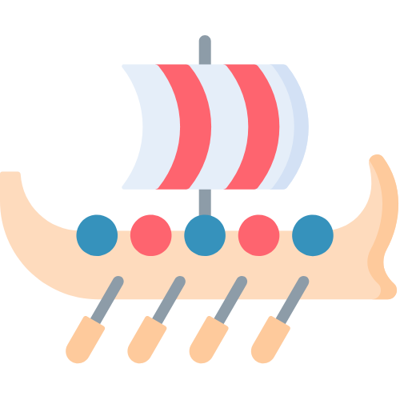

# Kaupskip Email Service

<p align="center">
  
</p>

## Introduction

**Kaupskip** (Old Norse for "merchant ship") is a modern, event-driven email service designed to manage all transactional and marketing emails for your application. Just as merchant ships were the reliable carriers of goods in Norse times, Kaupskip reliably delivers your important communications to users.

This microservice is built with FastAPI and implements a clean, event-driven architecture that seamlessly integrates with your main application through Redis pub/sub channels.

## Features

- 🚀 **Event-Driven Architecture**: Listens for events from your main application and sends appropriate emails
- 📧 **Templated Emails**: Beautiful, responsive HTML email templates with the Catppuccin Macchiato color scheme
- 🔐 **Verification Flows**: Built-in support for email verification workflows
- 📊 **Email Logging**: Comprehensive logging of all email activities
- 🔄 **Subscription Management**: Templates for subscription events (receipts, cancellations, etc.)
- 🧪 **Testing Tools**: Utilities for testing email templates

## Getting Started

### Prerequisites

- Docker and Docker Compose
- Redis server (can be run in Docker)
- SMTP server credentials (for sending emails)

### Environment Setup

1. Copy the example environment file and fill in your settings:

```bash
cp .env.example .env
```

2. Update the following variables in your `.env` file:

```
SMTP_HOST=your-smtp-server.com
SMTP_PORT=587
SMTP_USER=your-email@example.com
SMTP_PASSWORD=your-password
SERVICE_NAME=Your Service Name
MAIN_APP_URL=http://localhost:8000
SITE_URL=https://your-site.com
```

### Running with Docker

The simplest way to get started is using Docker Compose:

```bash
docker-compose up -d
```

This will:
- Build the Kaupskip container
- Connect to your Redis instance
- Expose the service on port 8001
- Set up health checks

### Manual Setup

If you prefer to run without Docker:

1. Install dependencies:

```bash
pip install -r requirements.txt
```

2. Run the service:

```bash
cd email_service
uvicorn src.main:app --host 0.0.0.0 --port 8001
```

## API Endpoints

- `GET /health`: Health check endpoint
- `POST /verify/email`: Request email verification
- `GET /verify/status/{user_id}`: Check verification status
- `GET /logs/email`: List email logs

## Event Channels

Kaupskip listens to the following Redis channels:

- `user_registration`: For new user signups
- `kaupskip:subscription`: For subscription events
- `kaupskip:marketing`: For marketing events

### Example Event Publishing

```python
# Publishing a user registration event
import json
import redis

r = redis.Redis(host='localhost', port=6379, db=0)
event_data = {
    "user_id": "user123",
    "email": "user@example.com",
    "verification_token": "abc123",
    "verification_url": "https://example.com/verify?token=abc123"
}
r.publish('user_registration', json.dumps(event_data))
```

## Email Templates

Kaupskip includes the following pre-designed email templates:

- Verification emails
- Welcome emails
- Subscription receipts
- Subscription cancellation notices
- Account change notifications
- Trial expiration reminders

All templates use the modern Catppuccin Macchiato color scheme and are designed to be responsive across devices.

## Testing Templates

To test email templates without sending actual emails, use the provided preview files or the test endpoint:

```bash
python -m src.utils.send-email-test
```

Then make a POST request to `http://localhost:8002/test-email` with:

```json
{
  "to_email": "your-email@example.com",
  "template_name": "welcome"
}
```

## Contributing

Contributions are welcome! Please feel free to submit a Pull Request.

## License

This project is licensed under the MIT License - see the LICENSE file for details.


